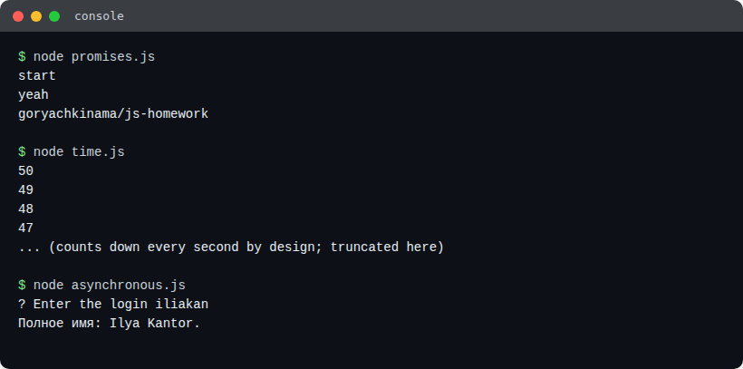
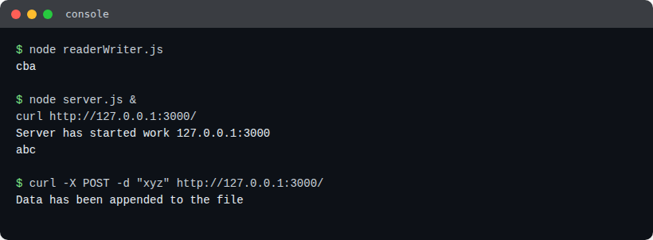
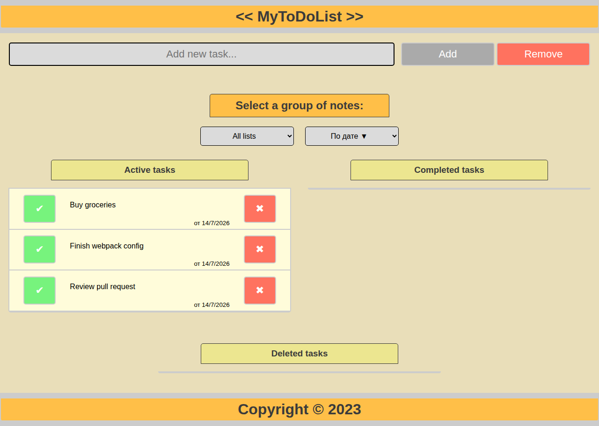
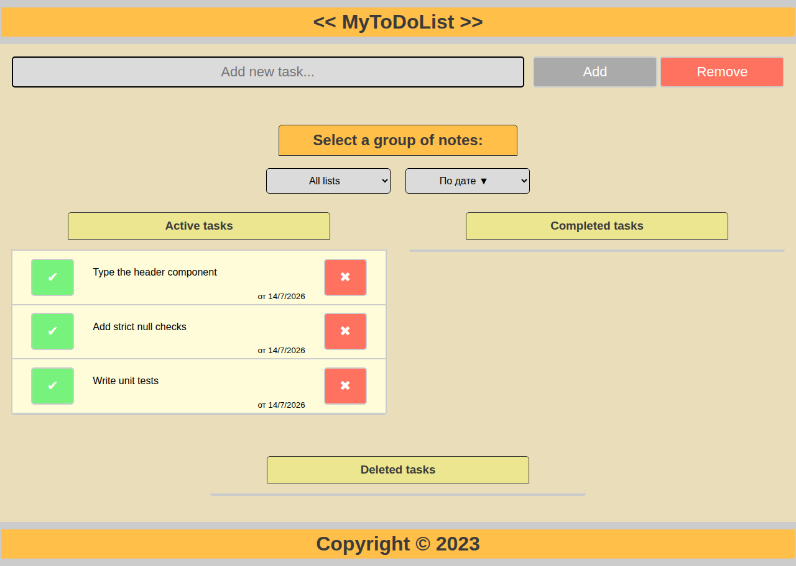
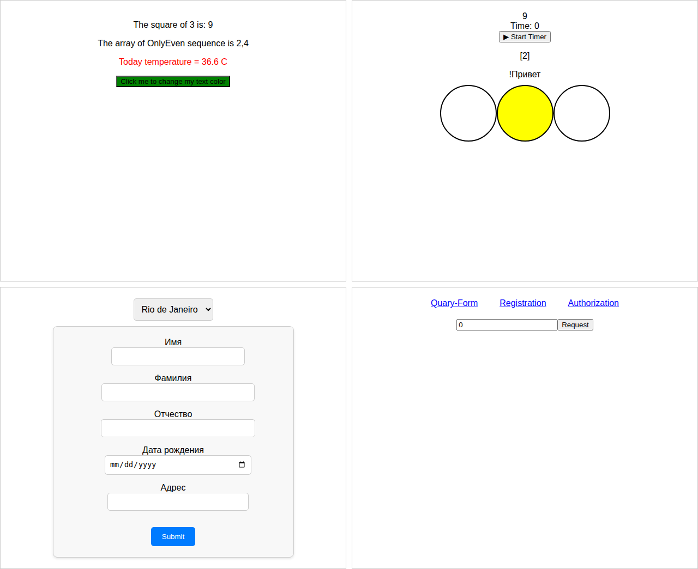
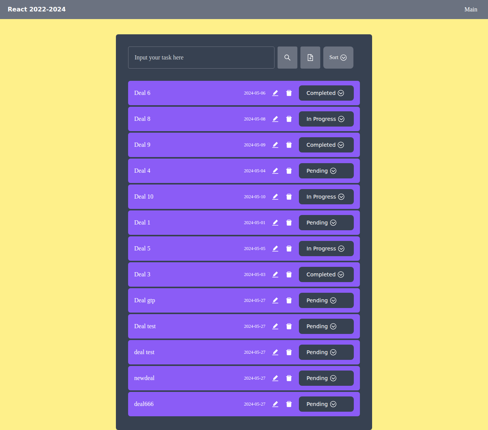

# WebDevelopment — JS → TS → React progression

> ⏹️ **Archived Coursework** — This repository contains laboratory/coursework exercises completed as part of university coursework. No longer actively maintained.

**Tech Stack:** JavaScript, TypeScript, React, Node.js/Express, SQLite
**Contents:** 15 labs (0-14, labs 13-14 not started) building the same to-do-list app up through three stacks, plus prep exercises for each stack

## Structure

One folder per lab under `labs/`, numbered and named after the course's own lab list ([`README-labs.md`](README-labs.md)). Several labs (0,1,2,5 and 7,8,9,10) build incrementally on the *same* running app rather than producing separate deliverables — since no per-lab snapshot was kept in git, the real code lives in the lab where that app was completed (**05** for the vanilla JS/CSS/HTML/Webpack app, **10** for the React basics app), and the earlier labs in each cluster are short pointer READMEs naming exactly which file(s) they contributed and linking to the shared code.

```
labs/
  00-html/                        -> pointer to 05 (this lab's contribution: public/index.html)
  01-css/                         -> pointer to 05 (public/css/styles.css)
  02-js-interactivity/            -> pointer to 05 (src/)
  03-async-javascript/            required/ + optional/ — real code
  04-nodejs-and-npm/              nodejs/ + npm/ — real code
  05-webpack-setup/               real code — the finished JS/CSS/HTML/Webpack todo-list app
  06-typescript/                  exercises/ + todo-app/ — real code
  07-react-hello-world/           -> pointer to 10 (src/components/kind-of-hello-react)
  08-react-hooks/                 -> pointer to 10 (src/components/kind-of-timers)
  09-react-forms/                 -> pointer to 10 (src/components/kind-of-forms)
  10-react-routing-and-queries/   real code — the finished React basics app (routing added last)
  11-react-typescript-rewrite/    real code — full React+TypeScript rewrite with an Express/SQLite backend
  12-testing/                     -> pointer to 11 (src/App.test.tsx)
  13-work-with-api/                not started
  14-other-frameworks/             not started
```

**How to run:** `05-webpack-setup/` and `06-typescript/todo-app/` are Webpack apps — `npm install && npm start` in either. `10-react-routing-and-queries/` is a Create React App — `npm install && npm start`. `11-react-typescript-rewrite/` needs its backend running first (`cd backend && npm install && npm start`, then `npm install && npm start` in the project root) since the frontend talks to `http://localhost:3001`.

## Labs

| Lab | Topic | Location | Preview |
|---|---|---|---|
| 00 | HTML | [`labs/00-html/`](labs/00-html) | see 05 |
| 01 | CSS | [`labs/01-css/`](labs/01-css) | see 05 |
| 02 | Оживляем список дел: прикручиваем JS | [`labs/02-js-interactivity/`](labs/02-js-interactivity) | see 05 |
| 03 | JavaScript: асинхронность, решение задач | [`labs/03-async-javascript/`](labs/03-async-javascript) |  |
| 04 | NodeJS и NPM | [`labs/04-nodejs-and-npm/`](labs/04-nodejs-and-npm) |  |
| 05 | Настройка инфраструктуры. Сборка проекта | [`labs/05-webpack-setup/`](labs/05-webpack-setup) |  |
| 06 | TypeScript | [`labs/06-typescript/`](labs/06-typescript) |  |
| 07 | React: настройка и "Hello world" | [`labs/07-react-hello-world/`](labs/07-react-hello-world) | see 10 |
| 08 | React: функциональные компоненты и хуки | [`labs/08-react-hooks/`](labs/08-react-hooks) | see 10 |
| 09 | React: формы, контролы, валидация | [`labs/09-react-forms/`](labs/09-react-forms) | see 10 |
| 10 | React: маршрутизация и запросы в сеть | [`labs/10-react-routing-and-queries/`](labs/10-react-routing-and-queries) |  |
| 11 | React + Typescript | [`labs/11-react-typescript-rewrite/`](labs/11-react-typescript-rewrite) |  |
| 12 | Тестирование: react-testing-library | [`labs/12-testing/`](labs/12-testing) | see 11 |
| 13 | Работа с API | [`labs/13-work-with-api/`](labs/13-work-with-api) | not started |
| 14 | Другие фреймворки | [`labs/14-other-frameworks/`](labs/14-other-frameworks) | not started |

Console-only exercises (labs 03, 04) are screenshotted as terminal-output panels since they have no page to render — see each folder's `results/` for the full command-by-command output, including [`labs/03-async-javascript/optional/`](labs/03-async-javascript/optional) which also has a small interactive HTML page (task 8).

See [`README-labs.md`](README-labs.md) for the original course task text.
