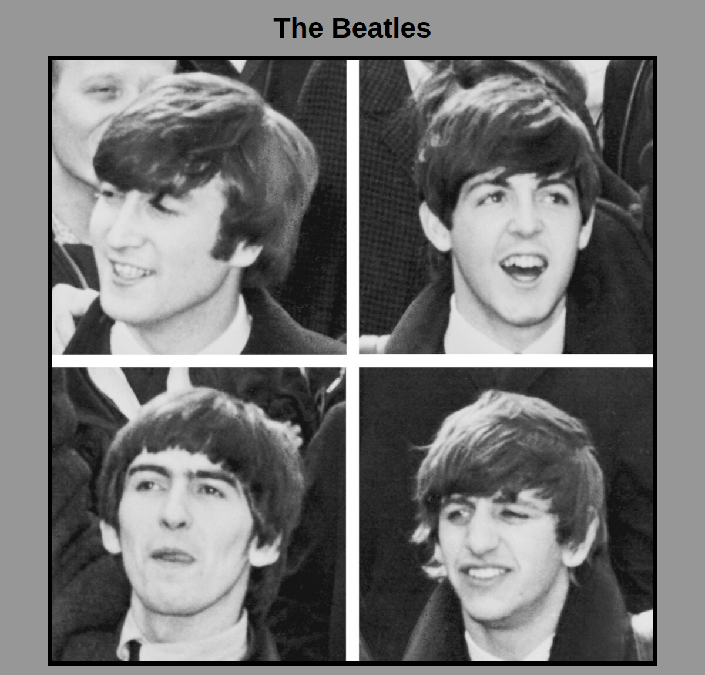

# WebDevelopment — laboratory works (plain HTML/CSS/JS)

> ⏹️ **Archived Coursework** — This repository contains laboratory/coursework exercises completed as part of university coursework. No longer actively maintained.

**Tech Stack:** HTML5, CSS3, JavaScript (vanilla)  
**Contents:** 10 lessons with 22 practices, final project, 70+ HTML pages with full screenshot documentation

A set of introductory front-end coursework: pure HTML5, CSS3, and vanilla JavaScript — no build tools, no frameworks, no dependencies. Each lesson folder holds the practical exercises done in that session, numbered continuously across the whole course (practice 1 through 22).

**How to view:** every practice is a static page — open its `.html` file directly in a browser, no server or build step needed. Two practices (07a, 08b) are Node console scripts instead — run them with `node <file>.js`. Click a practice name below to see every page/script in it with a full screenshot gallery; the preview here is just the single most representative shot.

## Structure

```
labs/
  00-prep/        pre-course warm-up
  01/ .. 10/       one folder per lesson, practices lettered a/b/c inside
final-project/     course capstone
sandbox/           standalone JS/Node experiments, outside the lesson sequence
```

## Lessons

### Lesson 00 — Prep
| Practice | Topic | Preview |
|---|---|---|
| [prep](labs/00-prep/README.md) | Course schedule page + a second "online translators" page |  |

### Lesson 01 — HTML basics
| Practice | Topic | Preview |
|---|---|---|
| [a](labs/01/practice-a/README.md) | "Cat family" site + a `<p>` tag demo |  |
| [b](labs/01/practice-b/README.md) | Paragraphs, text wrapping, absolute links — 4 pages |  |
| [c](labs/01/practice-c/README.md) | Mini-encyclopedia — intro page + Afonya (3 pages) + Dostoevsky (3 pages) |  |

### Lesson 02 — Layout & images
| Practice | Topic | Preview |
|---|---|---|
| [a](labs/02/practice-a/README.md) | Fast-food chain registry (KFC / McDonald's / Burger King) |  |
| [b](labs/02/practice-b/README.md) | Multi-page text layout exercises |  |
| [c](labs/02/practice-c/README.md) | Actor bio gallery — four linked profile pages + exercises |  |

### Lesson 03 — CSS styling
| Practice | Topic | Preview |
|---|---|---|
| [a](labs/03/practice-a/README.md) | "FantasyWorlds" — StarCraft-themed, 4 linked pages |  |
| [b](labs/03/practice-b/README.md) | Layout/styling exercises |  |

### Lesson 04 — Multi-page sites
| Practice | Topic | Preview |
|---|---|---|
| [a](labs/04/practice-a/README.md) | "MusSite" — music site with sub-pages |  |
| [b](labs/04/practice-b/README.md) | The Beatles — band page + all 4 member pages |  |

### Lesson 05 — Galleries & typography
| Practice | Topic | Preview |
|---|---|---|
| [a](labs/05/practice-a/README.md) | Art gallery — index + Aivazovsky + Repin + poetry pages |  |
| [b](labs/05/practice-b/README.md) | In-page anchor navigation |  |

### Lesson 06 — Forms
| Practice | Topic | Preview |
|---|---|---|
| [a](labs/06/practice-a/README.md) | Lab index/TOC page (links back through labs 1–13) + two form variants |  |
| [b](labs/06/practice-b/README.md) | "Know your weight" — a small BMI-style calculator |  |

### Lesson 07 — Intro to JavaScript
| Practice | Topic | Preview |
|---|---|---|
| [a](labs/07/practice-a/README.md) | Console-only JS: array sort, string manipulation (no page — screenshotted as a `node` console run) |  |
| [b](labs/07/practice-b/README.md) | JavaScript Tasks — two interactive pages |  |

### Lesson 08 — JavaScript DOM
| Practice | Topic | Preview |
|---|---|---|
| [a](labs/08/practice-a/README.md) | JavaScript Tasks — DOM manipulation |  |
| [b](labs/08/practice-b/README.md) | Console-only JS exercises (no page — screenshotted as a `node` console run) |  |

### Lesson 09 — Forms & JS validation
| Practice | Topic | Preview |
|---|---|---|
| [a](labs/09/practice-a/README.md) | Random topic test — Input handling |  |
| [b](labs/09/practice-b/README.md) | JavaScript Tasks |  |

### Lesson 10 — Final JS exercises
| Practice | Topic | Preview |
|---|---|---|
| [a](labs/10/practice-a/README.md) | JavaScript Tasks + a linked `site/` mini-project (3 pages) |  |
| [b](labs/10/practice-b/README.md) | JavaScript Tasks |  |

## Final project

**[Planning App](final-project/README.md)** — a to-do list app with task grouping (active / completed / deleted) and category filtering. The course capstone, pulling together everything from the lessons above.


## Sandbox

[`sandbox/`](sandbox) — standalone JavaScript/Node experiments (async patterns, module imports) written alongside the lessons but not tied to a specific one. Not part of the graded sequence.

## Related Laboratory Work

This repository is part of a series of university coursework projects:
- [**javascript-lab-webdev-plus-react**](https://github.com/nupolovykh/webdevelopment-laboratory-works-plus-react-project) — Web development with React
- [**javascript-lab-webdev-react-learning**](https://github.com/nupolovykh/webdevelopment-selfless-react-learning) — React learning exercises
- [**python-lab-parsing-and-testing**](https://github.com/nupolovykh/python-parsing-and-testing) — Python parsing and testing
- [**csharp-lab-dotnet-with-gidsik**](https://github.com/nupolovykh/dotnet-laboratoty-works-with-gidsik) — C# .NET coursework
- [**csharp-lab-winform-db-learning**](https://github.com/nupolovykh/winform-application-db-and-git-learning) — WinForm and database learning

All coursework repositories are marked with the `archived-coursework` topic for easy discovery on the GitHub profile.
