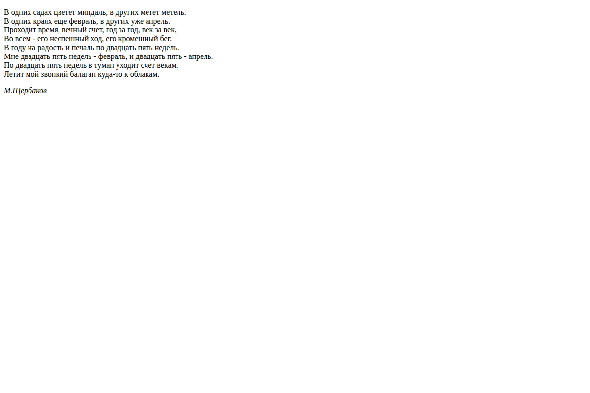
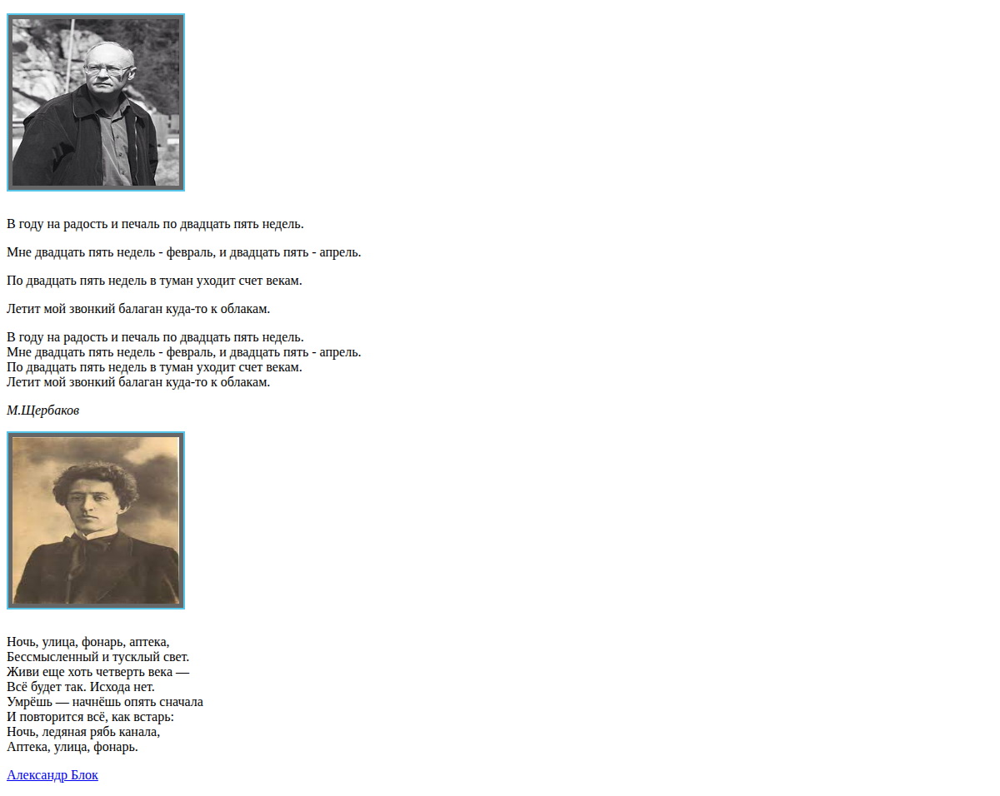
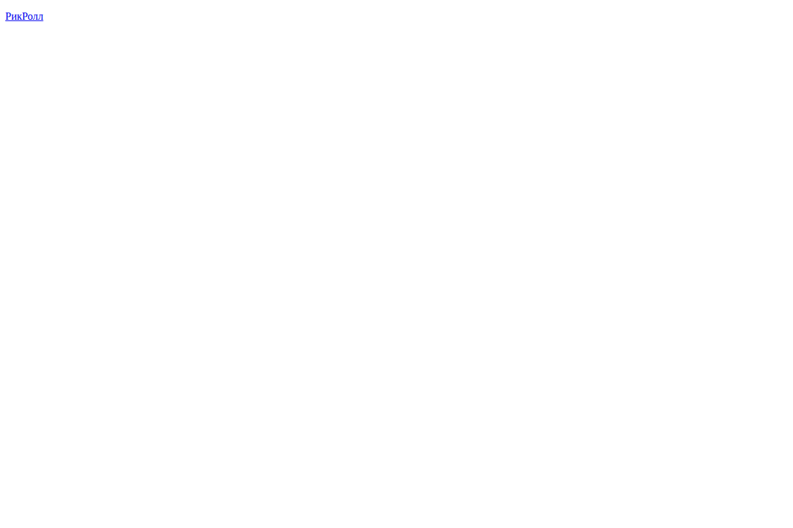

# Lesson 01 · Practice b — Paragraphs, wrapping, links

| Page | Preview |
|---|---|
| [Paragraph usage](second_pr.html) |  |
| [Text line wrapping](second.html) |  |
| [Absolute link — Blok poem](third.html) |  |
| [Absolute link — Rickroll](fourth.html) |  |

[← Back to main README](../../../README.md)
