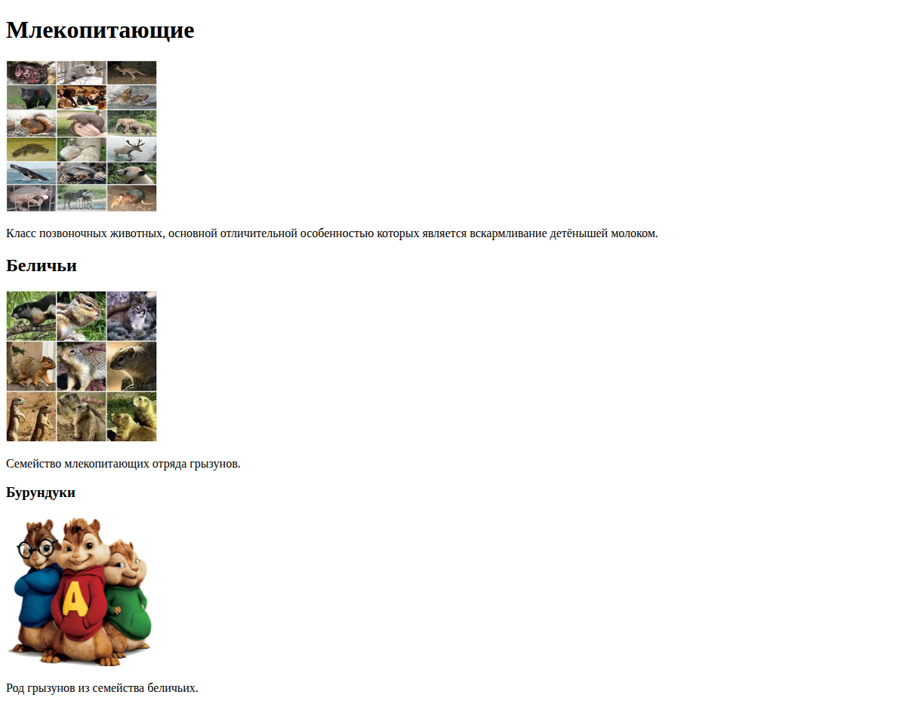
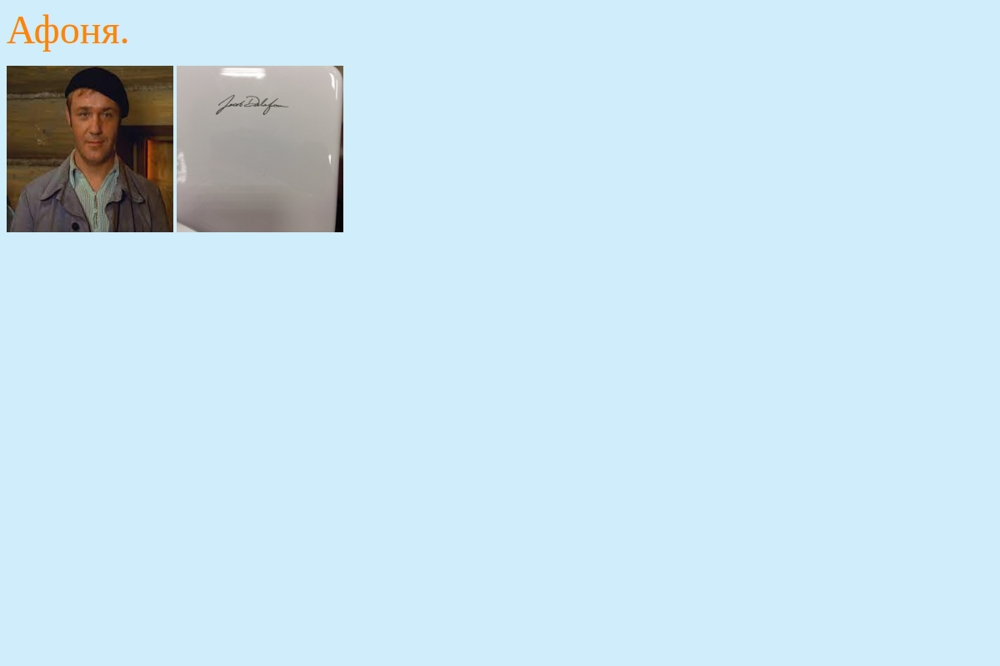
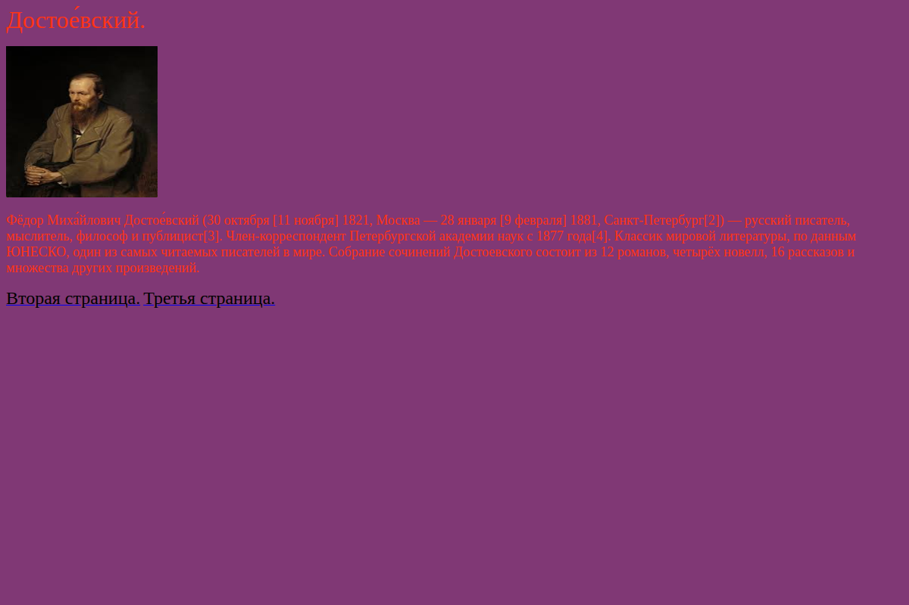
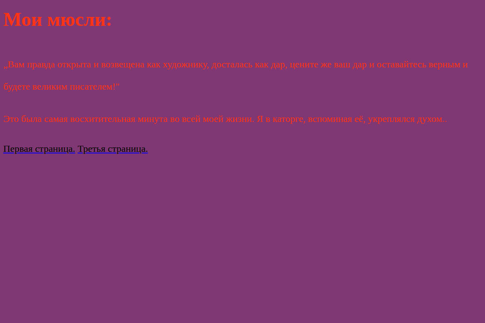
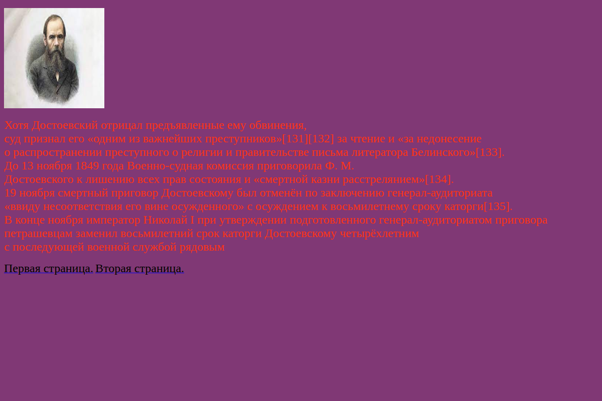

# Lesson 01 · Practice c — Mini-encyclopedia

| Page | Preview |
|---|---|
| [Encyclopedia](third_pr.html) |  |
| [Afonya — 1](afonya/first_s.html) |  |
| [Afonya — 2](afonya/second_s.html) |  |
| [Afonya — 3](afonya/third_s.html) |  |
| [Dostoevsky — 1](dostoevskiy/first_page.html) |  |
| [Dostoevsky — 2](dostoevskiy/second_page.html) |  |
| [Dostoevsky — 3](dostoevskiy/third_page.html) |  |

[← Back to main README](../../../README.md)
