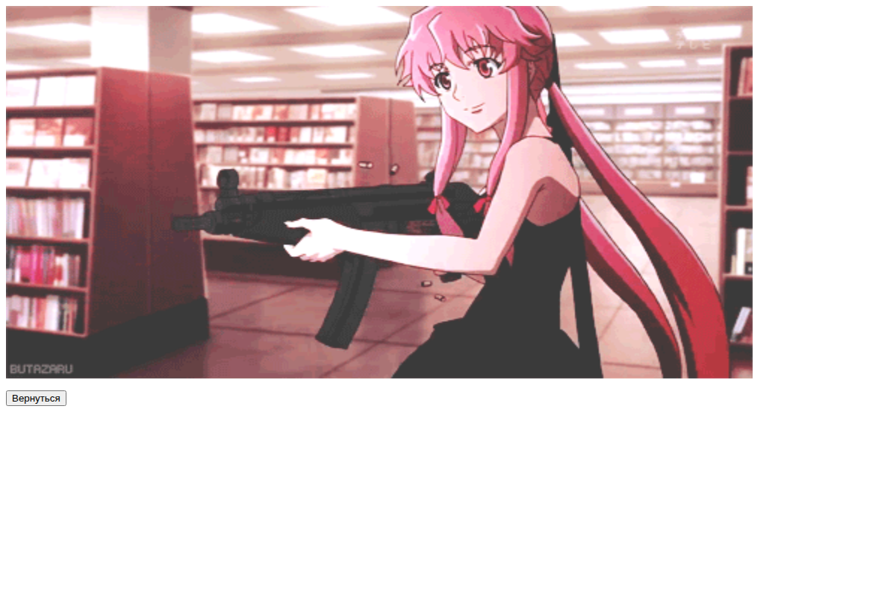
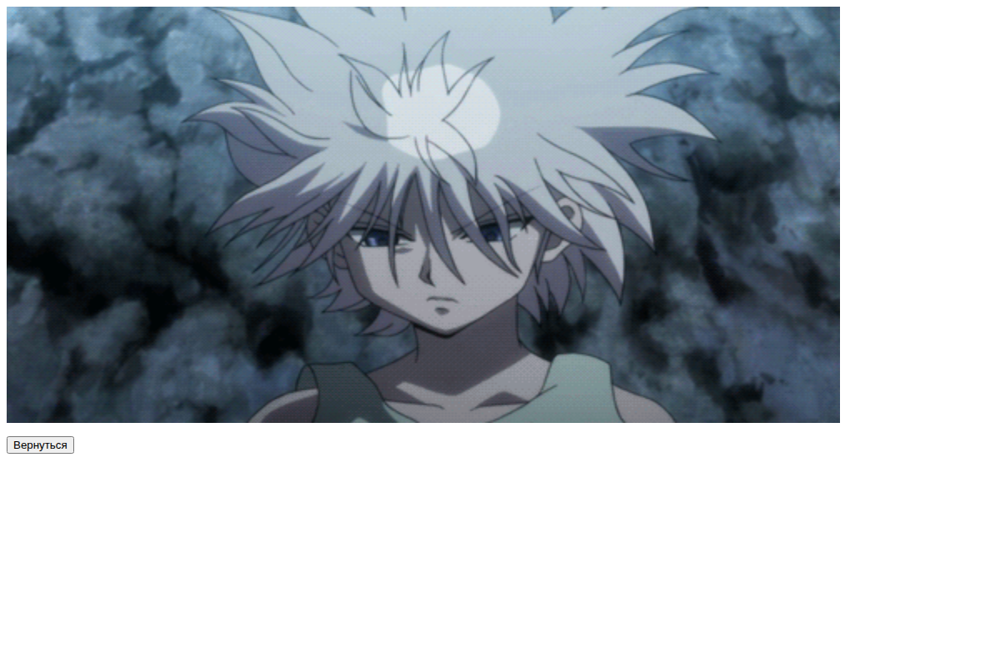
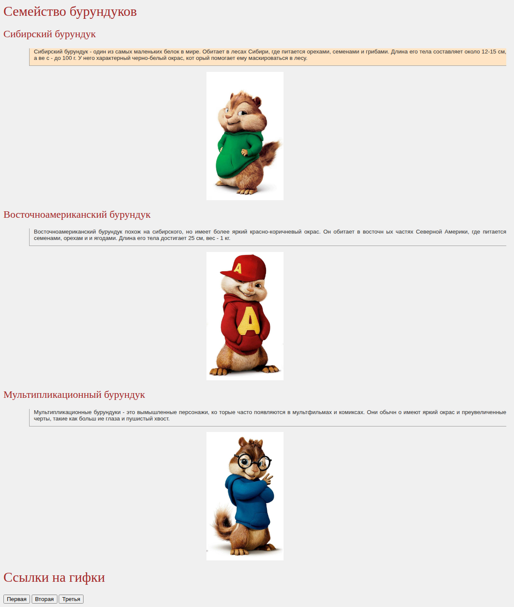

# Lesson 02 · Practice b — Text layout exercises

| Page | Preview |
|---|---|
| [1](second_page.html) |  |
| [2](third_page.html) |  |
| [3](fourth_page.html) |  |
| [Siberian chipmunk](exercise1.html) |  |
| [Chipmunk family](exercise2.html) |  |

[← Back to main README](../../../README.md)
