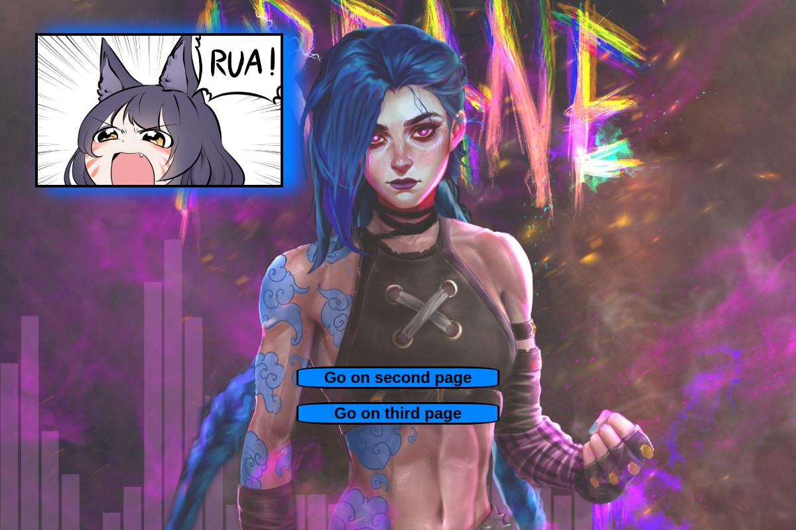
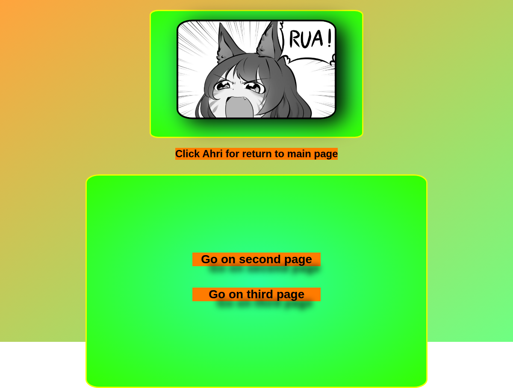

# Lesson 03 · Practice b — Layout/styling exercises

| Page | Preview |
|---|---|
| [Exercise](exercise.html) |  |
| [Styling exercise (page 2)](second_page.html) |  |
| [Styling exercise (page 3)](third_page.html) |  |

[← Back to main README](../../../README.md)
