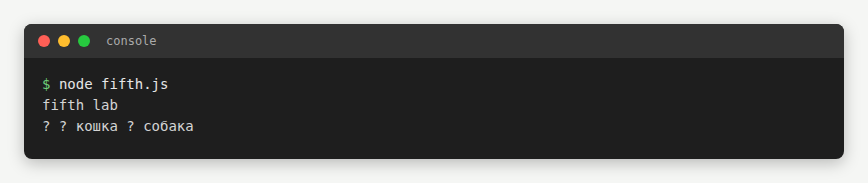
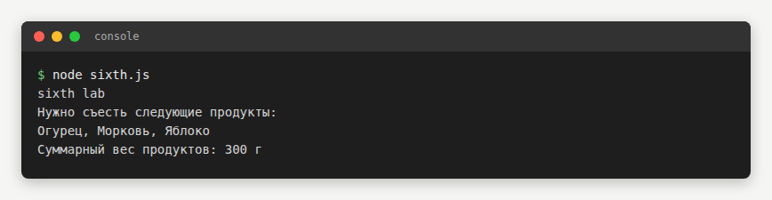

# Lesson 07 · Practice a — Console JS exercises

Console-only JavaScript exercises — no HTML page, screenshotted as `node` console runs instead:

| Script | Preview |
|---|---|
| [`fourth.js`](fourth.js) |  |
| [`fifth.js`](fifth.js) |  |
| [`sixth.js`](sixth.js) |  |

[← Back to main README](../../../README.md)
