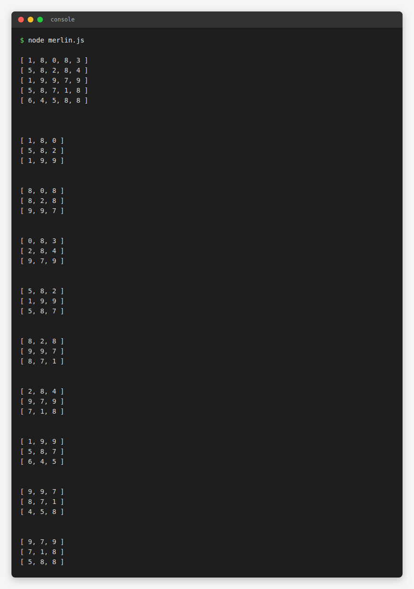
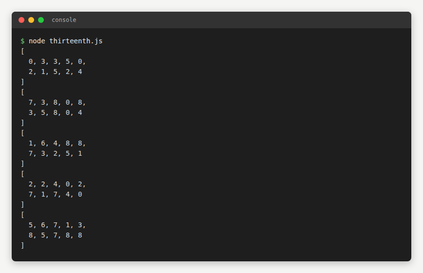

# Lesson 08 · Practice b — Console JS exercises

Console-only JavaScript exercises — no HTML page, screenshotted as `node` console runs instead:

| Script | Preview |
|---|---|
| [`continuation.js`](continuation.js) |  |
| [`merlin.js`](merlin.js) |  |
| [`thirteenth.js`](thirteenth.js) |  |

[← Back to main README](../../../README.md)
