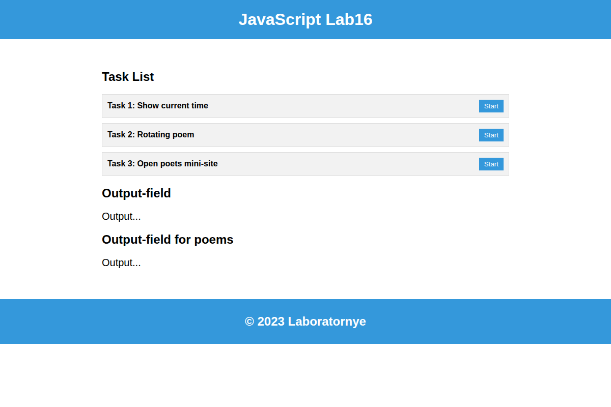
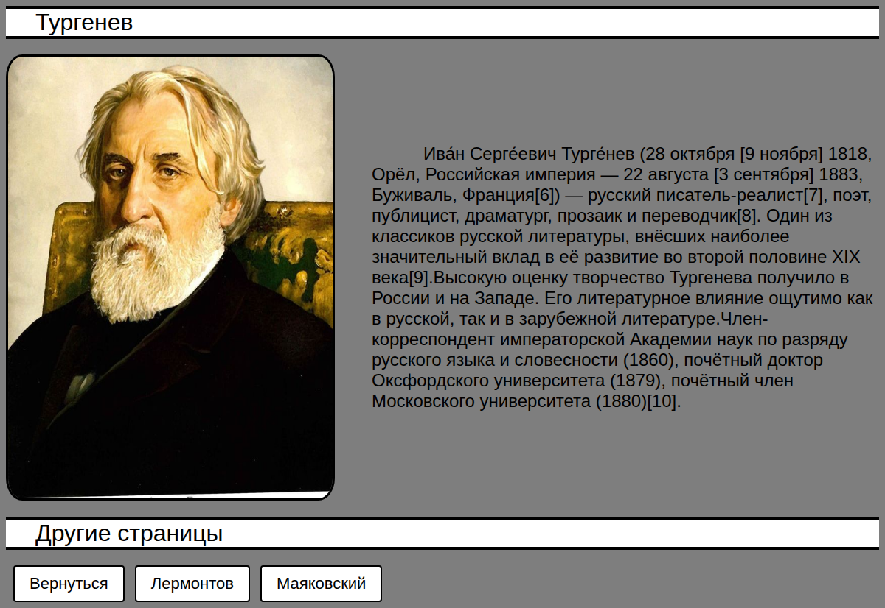
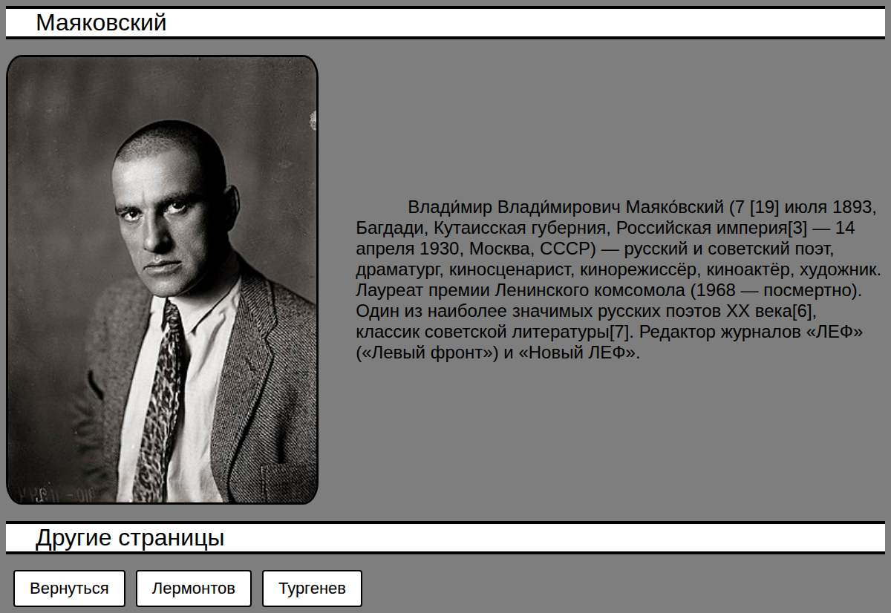

# Lesson 10 · Practice a — JavaScript Tasks + mini-site

| Page | Preview |
|---|---|
| [JavaScript Tasks](sixteenth.html) |  |
| [Lermontov](site/first.html) |  |
| [Turgenev](site/second.html) |  |
| [Mayakovsky](site/third.html) |  |

[← Back to main README](../../../README.md)
