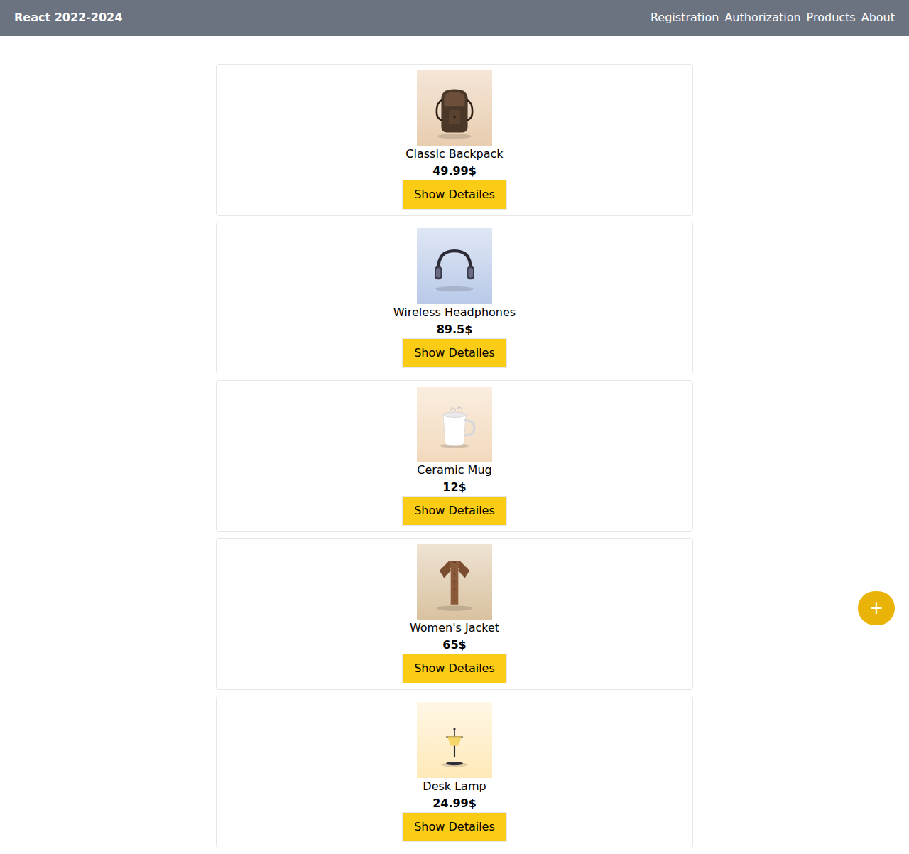
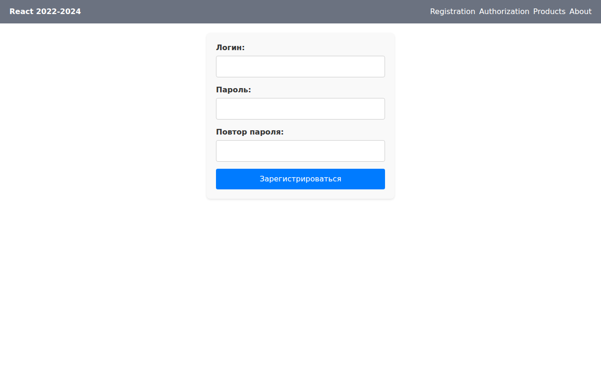

# React product catalog + GPT-era auth demo

> 🚀 **Portfolio Project** — a standalone app, not discrete lab exercises.

**Tech Stack:** React, TypeScript, React Router, Axios, Tailwind CSS · Node.js/Express + SQLite backend

A small product-catalog frontend (pulling live data from the [Fake Store API](https://fakestoreapi.com)) paired with a custom login/registration flow backed by a local Express + SQLite server (`gpt-backend/`) instead of a third-party auth provider.

## Structure

```
src/
  pages/          ProductPage, AboutPage
  components/     Navigation, Product, CreateProduct, Modal, Loader, Error
  gpt-components/ LoginComponent, RegisComponent — talk to gpt-backend/
  hooks/          useProducts (fetches from fakestoreapi.com)
gpt-backend/      Express + SQLite server handling /register and /login
```

## Running it

```bash
# backend (from gpt-backend/, so its relative db path resolves correctly)
cd gpt-backend && npm install && node server.js

# frontend (from the project root, in another terminal)
npm install && npm start
```

The frontend proxies `/register` and `/login` to `http://localhost:5000` (see the `proxy` field in `package.json`); the product list requires outbound internet access to `fakestoreapi.com`.

## Screens

| Screen | Preview |
|---|---|
| Product catalog (`/`) — cards fetched from the Fake Store API |  |
| Registration (`/register`) — talks to the local `gpt-backend/` |  |

`/login` mirrors the registration form; `/about` is a placeholder page (lorem ipsum) not pictured here.

**Note on the catalog screenshot:** this repo's docs are built in a sandboxed CI environment whose outbound network access is limited to an explicit allowlist (npm/PyPI registries, GitHub raw content) — `fakestoreapi.com` isn't reachable from it. The screenshot above mocks the API response with illustrated product art instead of real photos so the screenshot doesn't show a network-error page; running the app normally (`npm start`, with regular internet access) pulls real product data and photos from the live API.
